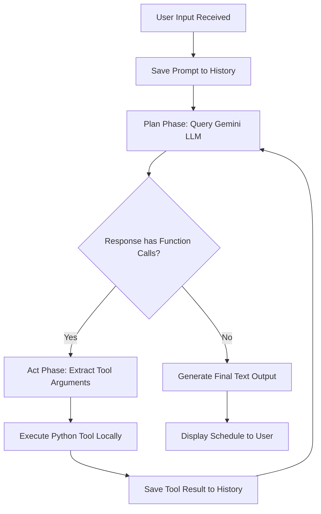
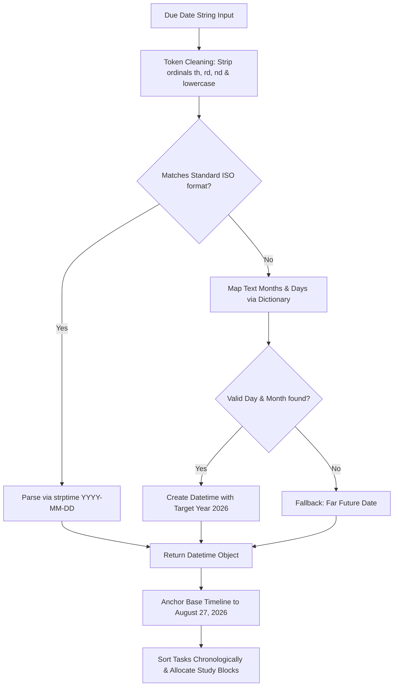

# Study Planner Agent (CSE476 CA1 Project 1)

This project implements a web-based and interactive academic study planner AI agent using Google's modern `google-genai` SDK. The agent is designed with an explicit, visible plan-act loop and maintains in-memory session state to help students schedule their study blocks around deadlines. It represents a hands-on demonstration of tool calling, session memory, and custom date parsing in agentic AI.

---

## 1. System Architecture

The project is structured as a decoupled web application with a Python Flask server hosting the business logic and a premium glassmorphic frontend user interface.

```
                  ┌──────────────────────────────┐
                  │      Web Browser Client      │
                  │  (HTML5 / CSS3 / Vanilla JS)  │
                  └──────────────┬▲──────────────┘
                                 ││ HTTP & JSON API
                                 ▼│
                  ┌──────────────────────────────┐
                  │      Flask Backend Server    │
                  │           (app.py)           │
                  └──────────────┬▲──────────────┘
                                 ││ Direct Invocation
                                 ▼│
                  ┌──────────────────────────────┐
                  │      StudyPlannerAgent       │
                  │          (agent.py)          │
                  └──────────────┬▲──────────────┘
                                 ││ Exposes Tools
                                 ▼│
                  ┌──────────────────────────────┐
                  │        Python Tools          │
                  │          (tools.py)          │
                  └──────────────┬▲──────────────┘
                                 ││ Inserts / Reads
                                 ▼│
                  ┌──────────────────────────────┐
                  │       Session Database       │
                  │          (memory.py)         │
                  └──────────────────────────────┘
```

---

## 2. Core Workflows & Flowcharts

### Flowchart 1: Plan-Act Execution Loop
The agent implements a manually orchestrated Plan-Act loop in [`agent.py`](file:///c:/Users/nvsai/Desktop/anti%20gravity/AI_Agent/agent.py) (by disabling standard library auto-function execution). This exposes intermediate LLM decisions, allowing developers to inspect tool-routing steps.



### Flowchart 2: Date Parsing & Chronological Sorting Heuristic
When the `build_schedule` tool in [`tools.py`](file:///c:/Users/nvsai/Desktop/anti%20gravity/AI_Agent/tools.py) is invoked, dates are parsed and sorted according to the following pipeline:



---

## 3. Code Modules & Roles

*   **[`agent.py`](file:///c:/Users/nvsai/Desktop/anti%20gravity/AI_Agent/agent.py)**: House of the `StudyPlannerAgent` class. Instantiates `genai.Client`, manages conversation history buffers as `Content` classes, and structures system prompt rules.
*   **[`tools.py`](file:///c:/Users/nvsai/Desktop/anti%20gravity/AI_Agent/tools.py)**: Defines capabilities exposed to Gemini: `add_task` (writes task dicts to memory) and `build_schedule` (parses, orders, and formats timelines).
*   **[`memory.py`](file:///c:/Users/nvsai/Desktop/anti%20gravity/AI_Agent/memory.py)**: Holds temporary, thread-safe session memory array `_tasks` along with state manipulators.
*   **[`app.py`](file:///c:/Users/nvsai/Desktop/anti%20gravity/AI_Agent/app.py)**: Flask backend wrapper. Defer-loads the agent client lazily to avoid crashes if keys are not configured. Captures standard stdout to forward console traces to the frontend UI.
*   **[`generate_report.py`](file:///c:/Users/nvsai/Desktop/anti%20gravity/AI_Agent/generate_report.py)**: Builds a publication-ready 5-page developer report PDF utilizing reportlab canvases.
*   **[`demo.ipynb`](file:///c:/Users/nvsai/Desktop/anti%20gravity/AI_Agent/demo.ipynb)**: Jupyter cell-by-cell tracing notebook showcasing agent loops.

---

## 4. REST API Contract

The Flask backend exposes the following JSON endpoints:

| Endpoint | Method | Request Payload | Response Schema |
| :--- | :---: | :--- | :--- |
| `/api/status` | `GET` | None | `{"ready": bool, "error": str, "message": str}` |
| `/api/tasks` | `GET` | None | `[{"name": "Task Name", "due": "Date Str"}]` |
| `/api/chat` | `POST` | `{"message": "string"}` | `{"response": "string", "steps": [steps_list], "tasks": [tasks_list]}` |
| `/api/clear` | `POST` | None | `{"status": "success", "message": "string"}` |

---

## 5. Setup & Running Instructions

### 1. Install Dependencies
Ensure you have Python installed, then fetch the core requirements:
```bash
pip install -r requirements.txt
pip install flask flask-cors reportlab pillow
```

### 2. Configure API Key
Create a `.env` file at the root of the project:
```env
GEMINI_API_KEY=your_actual_gemini_api_key
```

### 3. Run the Web Application
Start the Flask web server:
```bash
python app.py
```
Open your browser and navigate to **`http://127.0.0.1:5000`** to access the glassmorphic planner dashboard.

### 4. Compile the Project PDF Report
To compile the professional 5-page report in your local `Downloads` folder, run:
```bash
python generate_report.py
```
This saves `Study_Planner_Agent_Project_Report.pdf` with both vector flowchart diagrams in your local downloads folder.
